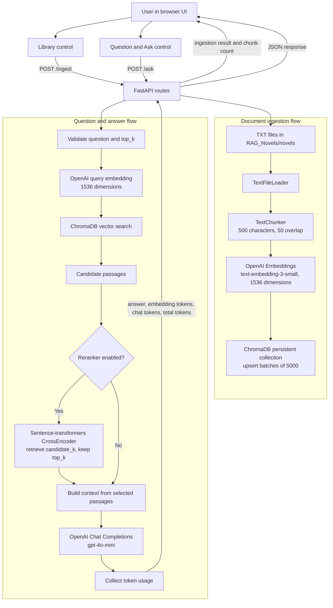

# Novel Atlas

Novel Atlas is a modular FastAPI RAG application for asking questions about text novels. The implemented pipeline is:

```text
Text files -> TextFileLoader -> TextChunker -> OpenAI embeddings -> ChromaDB
Question -> OpenAI query embedding -> ChromaDB vector search
         -> optional sentence-transformers CrossEncoder reranking
         -> OpenAI chat completion -> answer and token usage
```

## Architecture Flow Diagram

The following diagram shows the implemented request and response flow. Ingestion is triggered separately from the browser Library control or the `/ingest` endpoint.



### Query flow in plain language

1. The user submits a question from the browser UI.
2. FastAPI validates the request and sends the question to the OpenAI embedding provider.
3. The resulting 1536-dimensional query vector is sent to ChromaDB.
4. ChromaDB returns candidate passages.
5. If enabled, the sentence-transformers CrossEncoder reranks those passages and keeps the requested `top_k`. Otherwise, ChromaDB order is retained.
6. `RAGService` joins the selected passages into the context and sends it with the question to `gpt-4o-mini`.
7. The service collects embedding and chat token usage.
8. FastAPI returns the answer, question, and usage breakdown to the browser UI.

### Ingestion flow in plain language

1. The user opens the Library control and submits a directory.
2. FastAPI validates that the directory exists.
3. `TextFileLoader` reads the `.txt` files.
4. `TextChunker` creates `DocumentChunk` objects.
5. OpenAI generates embeddings in batches of 100.
6. ChromaDB stores the embedded chunks in upsert batches of 5,000.
7. Progress is written to the Uvicorn log, and the endpoint returns the stored chunk count.

## Implemented Architecture

### Ingestion

`RAG_Novels/loaders/text_loader.py` reads `.txt` files from a configured directory using UTF-8. It returns document records containing a file ID, source filename, and full text content.

`RAG_Novels/domain/chunker.py` splits each document into `DocumentChunk` objects. The current configuration is:

```text
Chunk size: 500 characters
Overlap: 50 characters
```

The implementation uses character positions, not token positions.

`RAG_Novels/adapters/embeddings/openai_embedding_provider.py` generates embeddings with:

```text
Model: text-embedding-3-small
Dimension: 1536
```

Embedding requests are batched in groups of 100. Progress is logged during ingestion.

`RAG_Novels/adapters/vectorstores/chroma_vector_store.py` stores embeddings in a persistent ChromaDB collection. Writes are split into batches of 5,000 because ChromaDB limits the maximum upsert batch size.

### Retrieval

For every question, the application generates a 1536-dimensional OpenAI query embedding. It passes that vector directly to ChromaDB using `query_embeddings`, so ChromaDB does not use a different default embedding model.

The default retrieval count is `top_k=3`.

The current implementation does not include BM25, keyword search, hybrid search, Reciprocal Rank Fusion, or a separately configured HNSW index.

### Optional Reranking

`RAG_Novels/adapters/rerankers/sentence_transformers_reranker.py` provides an optional CrossEncoder adapter:

```text
Model: cross-encoder/ms-marco-MiniLM-L-6-v2
Device: cpu by default
```

When enabled, the service retrieves more candidates from ChromaDB, scores each question/document pair with the CrossEncoder, sorts by score, and keeps the final `top_k` documents for generation.

The reranker is isolated behind the `Reranker` protocol in `RAG_Novels/domain/interfaces.py`:

```python
rerank(query: str, documents: list[str], top_k: int) -> list[str]
```

Another reranker can replace the current adapter by implementing this same contract.

### Generation and Usage Tracking

`RAG_Novels/adapters/chat/openai_chat_model.py` uses OpenAI chat completions with model `gpt-4o-mini`. Retrieved documents are joined into the context sent with the question.

The `/ask` response includes the generated answer and token usage:

```json
{
  "question": "Who is the main character?",
  "answer": "...",
  "usage": {
    "embedding_prompt_tokens": 8,
    "answer_prompt_tokens": 420,
    "answer_completion_tokens": 75,
    "total_tokens": 503
  }
}
```

The total includes the query embedding request and the chat completion request. Ingestion token usage is not currently returned by the API.

## Project Structure

```text
RAG_Novels/
├── adapters/
│   ├── chat/openai_chat_model.py
│   ├── embeddings/openai_embedding_provider.py
│   ├── rerankers/sentence_transformers_reranker.py
│   └── vectorstores/chroma_vector_store.py
├── domain/
│   ├── chunk.py
│   ├── chunker.py
│   └── interfaces.py
├── loaders/text_loader.py
├── services/rag_service.py
├── templates/index.html
├── app.py
├── config.py
└── routes.py
```

| Module                              | Responsibility                                                                 |
| ----------------------------------- | ------------------------------------------------------------------------------ |
| `app.py`                            | Builds concrete providers and creates the FastAPI application                  |
| `routes.py`                         | Serves the UI and exposes `/health`, `/ingest`, and `/ask`                     |
| `rag_service.py`                    | Coordinates loading, chunking, embedding, retrieval, reranking, and generation |
| `interfaces.py`                     | Defines replaceable provider contracts                                         |
| `text_loader.py`                    | Reads `.txt` files                                                             |
| `chunker.py`                        | Creates `DocumentChunk` objects                                                |
| `openai_embedding_provider.py`      | Generates OpenAI embeddings                                                    |
| `chroma_vector_store.py`            | Persists and queries ChromaDB vectors                                          |
| `sentence_transformers_reranker.py` | Optionally reranks retrieved documents                                         |
| `openai_chat_model.py`              | Generates the final answer                                                     |
| `index.html`                        | Browser interface for ingestion and questions                                  |

## Configuration

Settings are defined in `RAG_Novels/config.py` and can be overridden through environment variables:

```bash
export OPENAI_API_KEY="your-key"
export RERANKER_ENABLED=false
export RERANKER_MODEL="cross-encoder/ms-marco-MiniLM-L-6-v2"
export RERANKER_DEVICE="cpu"
export RERANKER_CANDIDATE_K=20
```

Reranking is disabled by default. When disabled, ChromaDB results are passed to the chat model in retrieval order.

## Setup and Run

```bash
python -m venv .venv
source .venv/bin/activate
pip install -r requirements.txt
uvicorn RAG_Novels.app:app --host 127.0.0.1 --port 8000 --reload
```

Open `http://127.0.0.1:8000/` and use the Library control to ingest the text files in `RAG_Novels/novels`.

The first enabled CrossEncoder run downloads its model from Hugging Face and caches it locally.

## API Endpoints

### Health check

```http
GET /health
```

### Ingest documents

```http
POST /ingest
Content-Type: application/json

{
  "directory_path": "RAG_Novels/novels"
}
```

The endpoint returns the number of stored chunks. Missing directories return HTTP 400.

### Ask a question

```http
POST /ask
Content-Type: application/json

{
  "question": "What is this story about?",
  "top_k": 3
}
```

## Modularity

The service receives providers through its constructor. To replace a provider, implement the corresponding contract and connect the new implementation in `app.py`:

- `EmbeddingProvider`: creates one or many embeddings
- `VectorStore`: stores and queries vectors
- `Reranker`: optionally orders retrieved documents
- `ChatModel`: generates an answer and usage data

The HTTP routes do not depend on OpenAI, ChromaDB, or sentence-transformers implementation details.

## Validation

Local tests are kept out of version control by `.gitignore`, but can be run locally with:

```bash
python -m unittest discover -s tests -v
python -m compileall -q RAG_Novels
```
